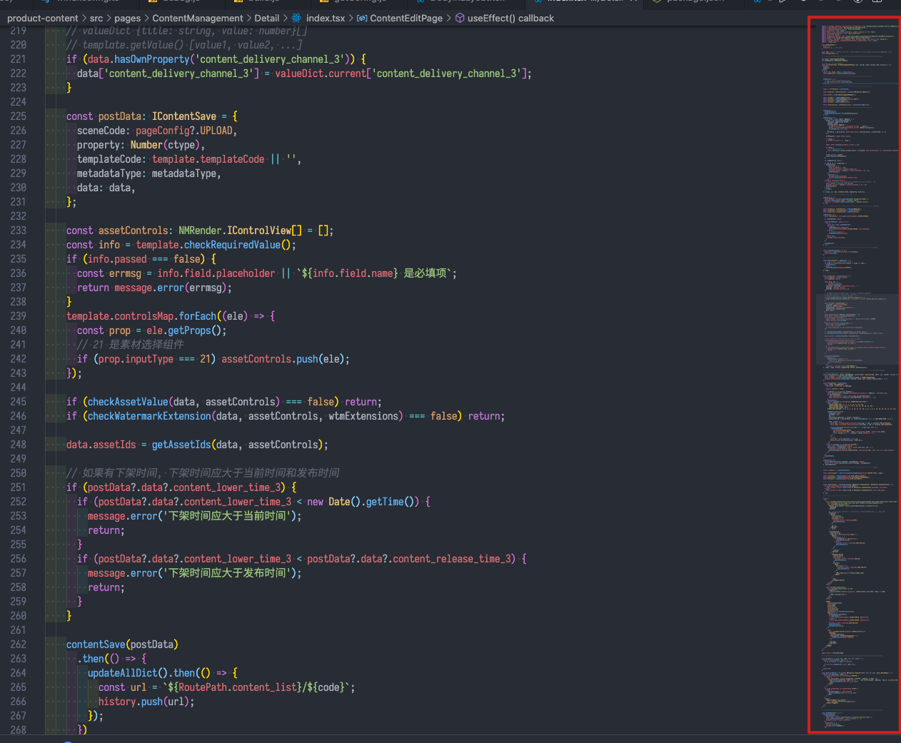

# React 组件通用开发模式

## 说明

**Q：这篇文章包含什么？**

A：爽写业务代码和 React 界面组件的通用思路

- 一个数据层
- 组件
  - 读数据
  - 写数据
  - 视图模板

**Q：这篇文章不包含什么？**

A：开发一个完整应用的剩余其他部分（因为写不下）

- 如何做 style（先用 sass、less、css modules 之类的）
- 如何做构建系统（先用 webpack 或者 cra 什么都好）
- 如何做路由、埋点、i18n 等其他问题
- 数据层具体选用什么工具（redux、rxjs、mobx、recoil 等各有优缺点，没有银弹）

**Q：为什么？**

> Programs are meant to be read by humans and only incidentally for computers to execute.  
> 程序是写给人读的，只是偶尔让计算机执行一下。  
>  —— Donald Knuth

> Any fool can write code that a computer can understand. Good programmers write code that humans can understand.  
> 跑得起来的代码谁都能写，而优秀的程序员写别人能看得懂的代码。  
>  —— Martin Fowler

> Good taste is about really seeing the big patterns and kind of instinctively knowing what's the right way to do things.  
> 好的品味是关于前瞻性和把事情做好的直觉。
> —— Linus Torvalds in an [interview](https://www.ted.com/talks/linus_torvalds_the_mind_behind_linux/transcript?language=en)

## 前言

我们不妨把现代前端开发的代码分为两个部分。

业务代码：

- 数据结构、接口、API
- CRUD 逻辑、交互逻辑
- HTML 模板和样式

基础设施代码：

- 构建系统（Webpack 等）
- 框架（React 等）
- 状态管理器（Hooks 等）
- 样式工具、公共样式库（Sass 等）
- 组件库（antd 等）
- 各种 Utils 库（Lodash、Axios 等）

要写一个完整的项目，这两个部分缺一不可。业务代码是能够直接产生业务价值的部分。

而基础设施则作为业务代码的生存土壤，良好（或够用）的基础设施能使开发人员（可以是自己）在编写业务的过程中专注于业务逻辑，而不用分心于技术工具。

基础设施这部分看上去多而杂，但一组经过充分设计的基础设施能够稳定地支撑功能和业务代码持续增长。

（这就好比，技术工具层出不穷，但 MVX 架构、GoF 设计模式、OOP 和 FP 范式这些经典理论依然没有过时一样。）

现代前端开发所使用的 MVVM 框架，相较于刀耕火种时代的 HTML、CSS、JS 三大件，或 MVC 初期的 Backbone、jQuery 等，已经有了极为显著的优势，解决了很多技术痛点。我们应该理解它们的设计思路，充分发挥它们的价值。

我总结出了一套通用（够用）的 React 界面开发模式，谈谈如何用 React 爽写界面组件。提升项目的产出质量、可维护性、开发效率和开发人员的愉悦度。

当然，这仅仅只是一小步，但即使是这一小步也需要团队的每个人坚持学习训练和思考。从培养扎实的编程素养和良好的代码品味，到不断探索解决和优化技术痛点，持续进步。才能最终落地到代码产出上，把产品做好。

## 编写组件代码的思路

`UI = f(state)`

上面这个公式可以代表大部分声明式编程框架的开发模式，React（Hooks 之后版本）也是其中之一。

这个思维方式极大地降低了编写大型前端项目的困难程度。

当我们把项目拆成组件树。在编写树上的单个节点时，我们需要关心的是，当这个组件具有某种状态，它应该渲染什么视图。以及给视图绑上事件，当什么事情发生时，应该反过来如何修改状态。

如此，一个应用就写成了。

写一段 React 伪代码：

```tsx
const Comp: FC<Props> = memo((props) => {
  // * ---------------- 取数据

  const { keyA, keyB } = props;
  const ctx = useCompContext();
  const [local, setLocal] = useState('');
  // ...

  // * ---------------- 组件相关的 action、effect 等

  useEffect(() => {
    fetchData();
  }, []);

  const update = () => {
    setLocal(props, ctx, local);
    ctx.changeData();
    apiTools.post();
  };

  // * ---------------- render

  const displayTextA = props + ctx + local;
  const displayTextB = clac(props + ctx + local);

  return (
    <div onClick={update}>
      {displayTextA} {displayTextB}
      <OtherCompA />
      <OtherCompB />
      {[1, 2].map((e) => (
        <OtherCompC key={e} item={e} />
      ))}
    </div>
  );
});
```

我们不妨把这段代码分为从上到下的三个部分。

- 读取（状态）：从一些地方拿到数据结构
- 写入（状态）：组件生命周期、用户点击事件、请求 API 等，会造成状态变动的代码，都可以聚集在这里。
- 输出（视图）：相对干净的模板代码，少量简单的数据处理，给模板挂上 ref、handler 等事件处理的钩子。

### 视图

先来说说比较简单的视图部分。

视图在 React 函数式组件里也就是 JSX 语法糖的返回值，对应了 `UI = f(state)` 中的 `UI`。

唯一需要注意的可能就是，当视图代码变得更大时，以什么时机和粒度对子组件做进一步抽象和拆分。

### 读取

视图是由状态驱动的，也就是 `state`。那么在视图之上，我们的技术需求则是，从一些来源获取状态，从状态中提取所需的数据结构。

函数组件的 `props` 参数显然是一种状态。更广义地来看，我们不妨把来自 `context` 的全局数据，以及 `useState` 的局部数据也视为一种“状态”。

这个环节的痛点是，如何方便地获取状态？或者反过来看，如何方便地传递状态？

只在组件内生成和消费的数据，`useState` 和组件内简单的计算结果，我们无需考虑传递的问题。

而在组件间传递状态的方式。诸如 `props`、`context`、Redux 的 `store`、`import` 进来的模块化对象等，是我们接下来需要重点分析的部分。

先来看 `props`，它的局限性是只能在父子组件间传递，这导致了在层级较深的情况下，非常不灵活。

写一个不是很恰当的 `props` 的伪代码：

```tsx
const AppRoot = () => <ContainerBlock text="Hello" />;

const ContainerBlock = ({ text }) => (
  <div id="container">
    <StyleBlock text={text} />
  </div>
);

const StyleBlock = ({ text }) => (
  <div className="style-block">
    <Content text={text} />
  </div>
);

const Content = ({ text }) => <span>{text}</span>;
```

其中的 `ContainerBlock` 和 `StyleBlock` 组件本身并不需要消费 `text`。仅仅为了把值一路传给深层级的 `Content` 组件，使它们被迫加入了自己本不需要、不应该关心的、其他组件的业务逻辑。产生了冗余的代码。

有一种修正办法，是把 `Content` 对 `text` 的消费一路冒泡到 `AppRoot` 上，看起来可以解决“跨层级”传参的问题。

```tsx
const AppRoot = () => (
  <ContainerBlock>
    <StyleBlock>
      <Content text={text} />
    </StyleBlock>
  </ContainerBlock>
);

const Container = ({ children }) => <div id="container">{children}</div>;

const StyleBlock = ({ children }) => <div className="style-block">{children}</div>;

const Content = ({ text }) => <span>{text}</span>;
```

但是这并没有完全解决问题。`ContainerBlock` 和 `StyleBlock` 的确借助 `children` 绕过了 `text`，但这只是把问题挪了一个位置 —— `Content`，或者说 `ContainerBlock` 内部的逻辑本不是 `AppRoot` 所应该关心的。无论怎么换位置，总还是有一个或多个组件用来承载它本不应该关心的逻辑。

我们假设都让 `AppRoot` 这个根节点来承载。那么当项目演进时，它承载的业务逻辑会随着代码规模线性增长，这显然不是一种 scalable 的解决方案。

更好的做法是，把提供状态的动作从组件中完全剥离出去，实现一个独立的数据层，想办法让任意深度的组件可以直接从数据层中各取所需就好。

以 context 伪代码为例：

```tsx
const AppRoot = () => {
  const ctx = useAppContext();
  return (
    <Provider value={ctx}>
      <ContainerBlock />
    </Provider>
  );
};

const ContainerBlock = () => (
  <div id="container">
    <StyleBlock />
  </div>
);

const StyleBlock = () => (
  <div className="style-block">
    <Content />
  </div>
);

const Content = () => {
  const { text } = useContext();
  return <span>{text}</span>;
};
```

可以看到，所有组件各司其职，大幅减少了组件之间的逻辑串扰，新增功能也不会让 `AppRoot` 承载更多的业务逻辑。这使组件拆分变得轻松，项目变得可扩展可维护。

写一个更具体的组件例子，我们使用 `Context`：

```tsx
import { TodoListContext } from './state';
import { useContext } from 'react';

export const TodoList: FC = memo(() => {
  const { todos } = useContext(TodoListContext);
  return <ul>{todos}</ul>;
});
```

或是 Redux：

```tsx
import { useSelector } from 'react-redux';

export const TodoList: FC = memo(() => {
  const todos = useSelector((state) => state.todos);
  return <ul>{todos}</ul>;
});
```

Mobx：

```tsx
import { TodoListState } from './state';
import { computed } from 'mobx';
import { observer } from 'mobx-react-lite';

export const TodoList: FC = observer(() => {
  const todos = computed(() => TodoListState.todos).get();
  return <ul>{todos}</ul>;
});
```

甚至是 RxJS（只用来做数据层）：

```tsx
import { todolist$ } from './state';
import { useObservableEagerState } from 'observable-hooks';

export const TodoList: FC = memo(() => {
  const { todos } = useObservableEagerState(todolist$);
  return <ul>{todos}</ul>;
});
```

可以看到，即使是不同的工具，只要有一个独立的数据层，我们都能满足任意深度组件取数据的技术需求。

我们甚至可以进一步把取值函数本身也视为数据层代码的一部分，遮蔽底层细节以便后续优化升级。

```tsx
import { useTodoValue } from './state';

export const TodoList: FC = memo(() => {
  const todos = useTodoValue((state) => state.todos);
  return <ul>{todos}</ul>;
});
```

### 写入

能够方便地读取数据之后，可以用一样的思路来解决写入的问题。

我们直接看刚才提到的几个第三方工具，他们对应的使用方式。

Redux 的 `dispatch` 的概念：

```tsx
import { useSelector, useDispatch } from 'react-redux';

export const TodoList: FC = memo(() => {
  const todos = useSelector((state) => state.todos);

  const dispatch = useDispatch();
  useEffect(() => {
    fetchTodos().then((todos) => dispatch({ type: 'update', payload: todos }));
  }, []);

  return <ul>{todos}</ul>;
});
```

Mobx 利用 Proxy 的机制直接 mutable 地写入：

```tsx
import { TodoListState } from './state';
import { computed } from 'mobx';
import { observer } from 'mobx-react-lite';

export const TodoList: FC = observer(() => {
  const todos = computed(() => TodoListState.todos).get();

  useEffect(() => {
    fetchTodos().then((todos) => (TodoListState.todos = todos));
  }, []);

  return <ul>{todos}</ul>;
});
```

RxJS 的 `BehaviourSubject` 的 `next` 方法：

```tsx
import { todolist$ } from './state';
import { useObservableEagerState } from 'observable-hooks';

export const TodoList: FC = memo(() => {
  const { todos } = useObservableEagerState(todolist$);

  useEffect(() => {
    fetchTodos().then((todos) => todolist$.next({ todos }));
  }, []);

  return <ul>{todos}</ul>;
});
```

当然，只是写入数据并不是故事的全部，数据变更了之后需要想办法对齐 `UI = f(state)` 这一公式。需要想办法重新执行组件函数，完成整个视图的更新。

索性 React 和这些工具基于 Hooks 的封装已经为我们自动实现，不劳我们亲自动手：

（注：为防止源码更新后链接 404，以下链接指向的都不是最新代码）

[`useState`、`useReducer` 源码的一部分][usestate code]
[usestate code]: https://github.com/facebook/react/blob/16.8.6/packages/react-reconciler/src/ReactFiberHooks.js#L578-L604

```ts
function mountReducer(/* ... */) {
  const hook = mountWorkInProgressHook();
  let initialState;
  // ...
  const queue = (hook.queue = {});
  const dispatch = (queue.dispatch = dispatchAction.bind(/* ... */));
  return [hook.memoizedState, dispatch];
}
```

[`useEffect` 源码的一部分][useeffect code]
[useeffect code]: https://github.com/facebook/react/blob/16.8.6/packages/react-reconciler/src/ReactFiberHooks.js#L813-L818

```ts
function mountEffectImpl(fiberEffectTag, hookEffectTag, create, deps): void {
  const hook = mountWorkInProgressHook();
  const nextDeps = deps === undefined ? null : deps;
  sideEffectTag |= fiberEffectTag;
  hook.memoizedState = pushEffect(hookEffectTag, create, undefined, nextDeps);
}
```

[`react-redux` 源码的一部分][react-redux code]
[react-redux code]: https://github.com/reduxjs/react-redux/blob/7.x/src/hooks/useSelector.js#L9-L101

```ts
function useSelectorWithStoreAndSubscription(selector, equalityFn, store, contextSub) {
  // ...
  const subscription = useMemo(() => createSubscription(store, contextSub), [store, contextSub]);
  // ...
  useIsomorphicLayoutEffect(() => {
    // ...
    return () => subscription.tryUnsubscribe();
  }, [store, subscription]);

  return selectedState;
}
```

[`observable-hooks` 源码的一部分][observable-hooks code]
[observable-hooks code]: https://github.com/crimx/observable-hooks/blob/master/packages/observable-hooks/src/use-observable-eager-state.ts#L53-L86

```ts
useEffect(() => {
  // ...
  const subscription = input$.subscribe({
    // ...
  });
  return () => subscription.unsubscribe();
}, [state$]);
```

可以看到 `queue`, `subscribe` 等关键词，也就是说这些工具只是 发布订阅/Observable/Proxy 等思想的具体应用。

在理解了这个思路之后，我们甚至能 [随手造一个 redux 的代替品](https://github.com/seognil-study/React-Simple-Store-Demo)

### 阶段小结

至此，React 组件编写模式的核心思路其实已经讲完了：

- 一个（或多个）数据层
- 单个组件
  - 直接读取数据层中的数据
  - 直接修改数据层中的数据
  - 视图模板
  - （用工具把上述步骤接起来实现自动渲染）

## 一些实践技巧

接下来讲一些编码细节

会配合一些开源库进行分析

- ant-design:<https://github.com/facebook/react>
- babel:<https://github.com/babel/babel>
- react:<https://github.com/ReactiveX/rxjs>
- rxjs:<https://github.com/ant-design/ant-design>

### TLDR

- 性能优化的迷思
- 用 TS
- 函数式编程
  - 只用箭头函数
  - 只用 `const`
  - 多用 `map`, `filter`, `reduce`，少用 `for` 循环
- 有意义的命名
- 编码
  - JS Doc 和注释
  - 排版
  - 单（组件）文件不超过 140 行
- export 别用 default

VS Code 的使用技巧

### 性能优化

**别用 `useMemo`、`useCallback`，除非你知道自己在干什么。**

我在不同项目里见过好多代码，加了 `useMemo`、加了 `useCallback`，看起来好像挺厉害。

打个 log 一看组件渲染了十几遍！

讲真… 别用 `useMemo`、`useCallback`…

简单的 computed 和 handler 直接铺在外面也没什么关系。更不要写下面这种脱裤子放屁的代码：

```tsx
// * ✅ Good
const App = ({ todos }) => {
  const remainCount = todos.filter((e) => !e.completed).length;
};

// * ❌ Bad
const App = ({ todos }) => {
  const [remainCount, setRemainCount] = useState(0);
  useEffect(() => {
    const remainCount = todos.filter((e) => !e.completed).length;
    setRemainCount(remainCount);
  }, [todos]);
};
```

我在一个两万行的“大”项目（微编辑器），把手势拖拽的性能优化到单帧 30ms，也不是靠 `useMemo` 和 `useCallback`。更何况普通的 CRUD 的表单页，性能优化要根据量化分析来具体做，在没有碰到瓶颈的时候，可以直接不用管。

而且，和我们上面设计数据层的思路一样，性能优化应该尽量作为基础设施的一部分，以便最大限度地自动提高生产效率。

最直接的例子：“vdom 的 diff” vs “自己手动处理 diff render” vs “原生全量 rerender”，又或者 mobx 的 `observer`。

如果你真的对性能优化感兴趣？那来点正经阅读材料：[【工业聚看论文】第一期：《Build Systems à la Carte: Theory and Practice》](https://zhuanlan.zhihu.com/p/375651053)

别用 `useMemo`、`useCallback`。

### 正确的 TS

编写正确的类型，能够保证业务逻辑的正确性。

也不要担心代码拆分。大部分主流编辑器，都能够追踪模块化导出对象的类型，从而进行自动补全和类型推断。

其实业务代码中常用的都是 TS 中朴实无华的概念：`type`、`interface`、泛型、偶尔有枚举，基本都没有什么难度。

那，什么叫正确的类型？举一些例子：

```tsx
// * ✅ 这个代码：
import type { FC } from 'react';
const App: FC<{ id: string; text: string }> = ({ id, text }) => {};

// * ❌ 比这个代码 ↓ 更正确一点！
const App = ({ id, text }: { id: string; text: string }) => {};
```

```tsx
// * ✅ 这个代码：
const inRange = (value: number, [min, max]: [number, number]) => {
  return Math.min(Math.max(value, min), max);
};

// * ❌ 比这个代码 ↓ 更正确一点！
const inRange = (value: number, [min, max]: number[]) => {
  return Math.min(Math.max(value, min), max);
};
```

```tsx
import { FC } from 'react';
import { RouteComponentProps, useParams } from 'react-router-dom';

// * ✅ Good
const List: FC<RouteComponentProps> = ({ history }) => {
  const { code } = useParams<{ code: string }>();
  // ...
};
```

```tsx
// * ✅ Good
const [items, setItems] = useState<Item[]>([]);
```

```tsx
// * ✅ Good
const containerRef = useRef<HTMLDivElement>(null);
```

```tsx
import { MouseEventHandler } from 'react';
// * ✅ Good
const mouseDown: MouseEventHandler<HTMLDivElement> = (e) => {};
```

```tsx
import { ChangeEvent } from 'react';
// * ✅ Good
const inputChange = (e: ChangeEvent<HTMLInputElement>) => {};
```

```tsx
import { CSSProperties } from 'react';
// * ✅ Good
const style: CSSProperties = {};
```

### 函数式编程

React Hooks 的设计哲学偏好函数式编程。

先不谈函数式架构设计。

在编码层面不妨只用箭头函数，不用 `function` （用了 `function` 你怎么用 `FC` 啊？）

```tsx
// * ✅ Good
const App: FC = () => {};

// * ❌ Bad
function App() {}
```

以及，只用 `const`，除非你需要变更才用 `let`。

减少 `let` 的一个方式是，处理数据时用 `Object.keys`, `Object.entries`, `map`, `filter`, `reduce` 等纯函数代替 for 循环。

```tsx
// * ✅ Good
const remainCount = todos.filter((e) => !e.completed).length;

// * ❌ Bad
let remainCount = 0;
for (let i = 0; i < todos.length; i++) {
  if (!todos[i].completed) remainCount += 1;
}
```

附一些开源项目的使用统计情况，可以看到，减少使用 `function` 和 `let` 没什么问题：

| repo                  |    => | function |  const |  let |
| :-------------------- | ----: | -------: | -----: | ---: |
| ant-design/components |  5660 |     1189 |   6450 |  435 |
| babel/packages        |  5704 |    12272 |   9847 | 3378 |
| react/packages        | 17654 |    10670 | 20000+ | 5826 |
| rxjs/src              |  1389 |     1067 |    870 |  221 |

### 有意义的命名

尽量采用和业务逻辑有关的命名，避免根据数据类型和执行方式来命名

用英文也不要瞎用，不熟悉的词宁可查字典，也不要乱用造成误导。

有一个辅助起名字的工具：<https://unbug.github.io/codelf/>

```tsx
// * ✅ Good
interface TodoItem {
  id: string;
  text: string;
}

// * ❌ Bad
interface IProps {
  id: string;
  text: string;
}
```

根据数据类型和执行方式命名的离谱性，就好比：`var num = 0`

我随便从项目里摘一些片段，可以体会一下什么叫难以维护。

（run 什么东西？一个动词为什么是 boolean？）

```tsx
// * ❌ Bad
const [run, setRun] = useState<boolean>(false);
```

（loop 啥的？）

```tsx
// * ❌ Bad
const loop = useCallback((column: IColumnsTreeNode[]) => {
  /* ... */
}, []);
```

（什么东西 visible？）

```tsx
// * ❌ Bad
const [visible, setVisible] = useState<boolean>(false);
```

（什么的 Index？什么 IProps？什么 value？）

```tsx
// * ❌ Bad
const Index: React.FC<IProps> = (/* ... */) => {
  const [value, setValue] = React.useState([]);
  // ...
};
```

### JS Doc 和注释

首先尽量直接使用有意义的命名，实在需要补充说明了再用注释。

JS Doc，`/** */` 这个形式的注释，可以被主流编辑器识别，和 TS 类型一样会随目标对象一起携带。

注意到，有两种写法，一般来说，因为参数和返回值的类型信息已经通过 TS 得到补充，那么剩下 description 直接用单行注释就好。

```tsx
// * 🟡 Not so good

/**
 * @description 原地从小到大排序
 * @arguments arr number[]
 * @returns arr number[]
 */
const sort = (arr: number[]) => arr.sort((a, b) => a - b);
```

```tsx
// * ✅ Good

/** 原地从小到大排序 */
const sort = (arr: number[]) => arr.sort((a, b) => a - b);
```

用 `deprecated` 来标记废弃逻辑。

```tsx
// * ✅ Good

/** @deprecated 用的地方直接自行处理了，没必要多写一个 util */
const sort = (arr: number[]) => arr.sort((a, b) => a - b);
```

以及，更常见的情况是，在严肃的项目中，给业务接口的每个字段都写上注释。

```tsx
// * ✅ Good

/** 上传素材类型 */
export enum UploadEntityType {
  /** 从素材库选取的素材 */
  fromSelector = '0',
  /** 直接本地上传文件的图片 */
  fromLocal = '1',
}
```

普通注释方面，也可以通过达成一些“共识”，让注释携带更多信息

[Better Comments](https://marketplace.visualstudio.com/items?itemName=aaron-bond.better-comments)

```tsx
// TODO 晚点检查这段逻辑 // Seognil LC 2021/09/15

// TODO 如果不用可以删除 // Seognil LC 2021/09/15

// ! 不安全的脏实现
```

### 代码排版

像写文章一样，文章靠标点符号、段落、留白增加可读性。

代码也可以用空格切分不同的作用/过程/逻辑。

更进一步的，可以利用注释做“段落”的分割线 [Commenting - C Style](http://syque.com/cstyle/ch4.6.htm)

（我的习惯是以 16 的倍数作为分割线的长度）

```tsx
// * ================================================================================

// * ----------------------------------------------------------------

// * ------------------------------------------------

// * --------------------------------

// * ----------------
```

配合语法高亮：[程序员的电脑都是花花绿绿的吗？](https://www.zhihu.com/question/60737937/answer/179568207)

这一套组合拳下来，从视觉上可以显著提升代码段携带的信息，扫一眼就能大致看出代码结构。这样即使在比较长的单文件也能快速定位到目标代码：

```tsx
import { FC } from 'react';

// * ================================================================================ Comp

const TodoListContainer: FC = () => {
  // * ---------------- states

  const [loading, setLoading] = useState(false);

  // * ---------------- 初始化，拉取数据

  useEffect(() => {
    setLoading(true);

    fetch(api.xxx).then((e) => {
      setLoading(false);
      toolA(e);
      toolB(e);
    });
  }, []);

  // * ---------------- render

  return <div>{xxx}</div>;
};

// * ================================================================================ Utils

// * ------------------------------------------------ toolA

const toolA = () => {
  /* ... */
};

// * ------------------------------------------------ toolB

const toolB = () => {
  /* ... */
};
```

### 代码拆分

类比更长的文章，需要用章节和目录来整理内容。

对于更长的代码，最好还是利用模块化（文件）进行拆分。

我的习惯是，除去 API、配置文件等更适合集中管理的代码。业务代码的单文件**不超过 140 行**（经验值），如果超过了这个数字，那一般都说明组件承担了过多的指责，这会使可维护性降低。

同样是刚才的几个开源库，用 scc 分析文件的代码行数：

- 统计全部文件数量：`scc --no-cocomo --include-ext ts,tsx`
- 剔除大于 140 行的文件数量：`scc --no-cocomo --include-ext ts,tsx --large-line-count 141 --no-large`

（react 是 `--include-ext js`）

| files                 |  all | <=140 | ratio |
| :-------------------- | ---: | ----: | ----: |
| ant-design/components |  722 |   655 |   90% |
| babel/packages        |  949 |   847 |   89% |
| react/packages        | 1362 |   859 |   63% |
| rxjs/src              |  250 |   218 |   87% |

可以看到，这些仓库中绝大部分文件都小于 140 行。

即使像 react 这样的巨型 monorepo，也有超过一半的小文件。

### 模块化

export 直接具名导出，不用 default

同样是刚才的几个开源库，在源码中分别搜索 `^export\s` 和 `^export default`

| repo                  | export | default | d/e % |
| :-------------------- | -----: | ------: | ----: |
| ant-design/components |   1254 |     538 |   43% |
| babel/packages        |   4447 |     679 |   15% |
| react/packages        |   3786 |     211 |    6% |
| rxjs/src              |    929 |       0 |    0% |

可以看到 `default` 的使用率并不高

即使是 ant design 作为组件库，源码中有一半是 `export default`，也有等量的 `export { default as XXX } from 'xxx'`

而 rxjs 甚至完全不使用 `export default`

default 在使用上的劣势，参考这篇文章： [球球你们，别再用 export default 了。](https://zhuanlan.zhihu.com/p/97737035)

### VS Code

同时，利用好代码编辑器自带的功能。

写新代码的时候，利用 [Snippet 系统](https://code.visualstudio.com/docs/editor/userdefinedsnippets) 将常用的代码片段做成快捷触发。

比如

（`QQ` 是我自己用的触发的前缀）

```json
{
  "Comment Line 1": {
    "prefix": "QQ",
    "body": ["$LINE_COMMENT * ---------------- $1"],
    "description": "Comment Line 1"
  }
}
```

```json
{
  "console.log": {
    "prefix": "LOG",
    "scope": "javascript,typescript,javascriptreact,typescriptreact",
    "body": ["console.log('lcdebug $RANDOM_HEX', ${1})"],
    "description": "short for console.log"
  }
}
```

```tsx
import React, { memo } from 'react';
import type { FC } from 'react';

export const App: FC = memo(() => {
  return (
    <>
      <div>
        <span>Hello</span>
      </div>
    </>
  );
});
```

做优化的时候，借助 [多选编辑](https://code.visualstudio.com/docs/editor/codebasics#_multiple-selections-multicursor) 和 [重命名变量](https://code.visualstudio.com/docs/editor/refactoring#_rename-symbol) 重构代码。

## 旧代码维护

当然，有了写代码的思路，我们在写新代码的时候就可以顺利用上了。

这里的新代码可以是独立的新项目，但更多情况是给老的系统加入新功能、或修复现有 bug。

如果碰到的是屎山代码，即时重构，先捋一遍旧代码，重建丢失的业务逻辑。

1. 语意不明：重命名变量、注释、补充类型
2. 逻辑混乱：将同一功能的代码聚集在一起
3. 代码量太大：将部分复杂的逻辑拆解成独立的函数或 hooks，然后通过传参调用
4. 进一步拆解：做一个独立的数据层（如果没有的话），重构数据传递的逻辑

（上线前记得回归嗷）

## 附

### 一个较完整的代码文件

```tsx
import { cx } from '@emotion/css';
import type { FC } from 'react';
import React, { memo, useEffect, useRef, useState } from 'react';
import { useTodoContext } from '../data/state';
import { TodoItem } from '../data/types';

// * ================================================================================

// * ---------------------------------------------------------------- TodoList

export const TodoList: FC = memo(() => {
  const {
    value: { filterMode, todolist, remainItems, doneItems },
  } = useTodoContext();

  const displayTodos =
    filterMode === 'REMAIN' ? remainItems : filterMode === 'DONE' ? doneItems : todolist;

  return (
    <ul className="todo-list">
      {displayTodos.map((item) => (
        <TodoListItem key={item.id} item={item} />
      ))}
    </ul>
  );
});

// * ---------------------------------------------------------------- TodoListItem

const TodoListItem: FC<{ item: TodoItem }> = memo(({ item }) => {
  const { id, text, done } = item;
  const { action } = useTodoContext();

  const [localValue, setLocalValue] = useState('');
  const [editing, setEditing] = useState(false);

  // * ---------------- input auto focus effect

  const todoEditInputRef = useRef<HTMLInputElement>(null);
  useEffect(() => todoEditInputRef.current?.focus(), [editing]);

  // * ---------------- action

  const updateTodoComplete = () => action.updateTodos([{ id, done: !done }]);
  const deleteTodo = () => action.deleteTodos([id]);

  const intoTextEditing = () => {
    setEditing(true);
    setLocalValue(text);
  };

  const exitTextEdition = () => {
    setEditing(false);
    if (localValue !== text) action.updateTodos([{ id, text: localValue }]);
  };

  // * ---------------- render

  return (
    <li className={cx({ completed: done, editing })}>
      <div className="view">
        <input className="toggle" type="checkbox" checked={done} onChange={updateTodoComplete} />

        <label onDoubleClick={intoTextEditing}>{text}</label>

        <button className="destroy" onClick={deleteTodo} />
      </div>

      <input
        ref={todoEditInputRef}
        className="edit"
        value={localValue}
        onChange={(e) => setLocalValue(e.target.value)}
        onKeyDown={(e) => e.key === 'Enter' && exitTextEdition()}
        onBlur={exitTextEdition}
      />
    </li>
  );
});
```

### 反面教材



### 相关的 eslint config

```js
module.exports = {
  extends: ['alloy', 'alloy/react', 'alloy/typescript'],
  plugins: ['react-hooks', 'import', 'prefer-arrow'],
  rules: {
    // * ------------------------------------------------ react hooks

    'react-hooks/rules-of-hooks': 'error',
    'react-hooks/exhaustive-deps': 'warn',

    // * ------------------------------------------------ lines

    'max-lines': ['warn', 140],
    'max-lines-per-function': ['warn', 120],

    // * ------------------------------------------------ import

    'import/no-default-export': 'error',
    'import/no-extraneous-dependencies': 'error',

    // * ------------------------------------------------ arrow function

    'prefer-arrow/prefer-arrow-functions': [
      'warn',
      {
        disallowPrototype: true,
        singleReturnOnly: false,
        classPropertiesAllowed: false,
      },
    ],
    'prefer-arrow-callback': ['warn', { allowNamedFunctions: true }],
    'func-style': ['error', 'declaration', { allowArrowFunctions: true }],

    // * ------------------------------------------------ misc

    'max-params': 'warn',
    'no-unreachable': 'warn',
  },
  settings: { react: { version: 'detect' } },
};
```

### 参考资料

- [【工业聚看论文】第一期：《Build Systems à la Carte: Theory and Practice》](https://zhuanlan.zhihu.com/p/375651053)
- [球球你们，别再用 export default 了。](https://zhuanlan.zhihu.com/p/97737035)
- [代码整洁之道](https://book.douban.com/subject/4199741/)
- [When and why to clean up your code: now, later, never](https://codewithoutrules.com/2018/11/02/when-clean-up-your-code/)
- [GoF 设计模式](https://refactoringguru.cn/design-patterns/catalog)
- [Commenting - C Style](http://syque.com/cstyle/ch4.6.htm)
- [VS Code Top-Ten Pro Tips](https://www.youtube.com/watch?v=u21W_tfPVrY)
- [Object Oriented vs Functional Programming with TypeScript](https://www.youtube.com/watch?v=fsVL_xrYO0w)
- [Functional Programming in 40 Minutes • Russ Olsen • GOTO 2018](https://www.youtube.com/watch?v=0if71HOyVjY)
- [Functional programming design patterns by Scott Wlaschin](https://www.youtube.com/watch?v=E8I19uA-wGY)
- [Functional architecture - The pits of success - Mark Seemann](https://www.youtube.com/watch?v=US8QG9I1XW0)
- [How Functional Programming Can Make You A Better Developer](https://www.youtube.com/watch?v=EqO4TcNLjl0)
